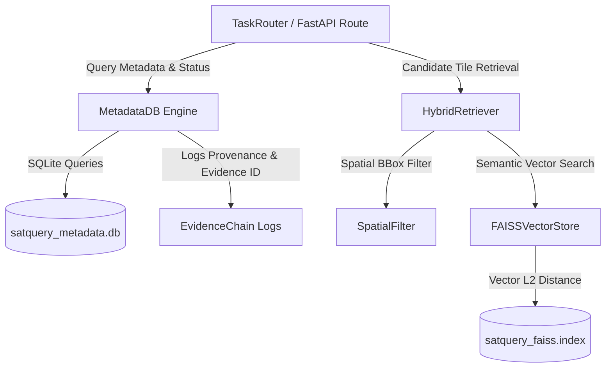

# SatQuery AI — Technical Handoff Guide
## Module: Database, Metadata Storage & Vector Search
**Target Developer**: Soumyadeep Garai (Database, Storage & Data Contracts Engineer)  
**Author**: Anindya Bhattacharya (Chief Technical Architect)  
**Project**: SatQuery AI — Interactive Multimodal Remote Sensing Intelligence Engine  

---

## 1. Executive Summary & Module Overview

Welcome to the **SatQuery AI Database & Storage Subsystem**. As the Database & Data Contracts Engineer, your responsibility covers:
1. Managing long-term query logs, task status, and execution metadata.
2. Managing semantic vector search indices over satellite image tiles.
3. Defining data provenance contracts that link spatial observations to evidence IDs.
4. **Next Milestone**: Upgrading from SQLite to **PostgreSQL + PostGIS** for native spatial queries (`ST_DWithin`, `ST_Area`, `ST_Intersects`) and upgrading FAISS from synthetic vectors to real CLIP/OpenCLIP embeddings.

---

## 2. Architecture & How Your Code Currently Works

### Data Flow Diagram



### Relevant Code Files

| File Path | Description | Key Classes / Functions |
|---|---|---|
| [`backend/app/storage/metadata_db.py`](file:///c:/Users/Administrator/Desktop/satquery-SIH/backend/app/storage/metadata_db.py) | SQLite database manager for job metadata & query history | `MetadataDB`, `init_db()`, `create_job()`, `update_job_status()` |
| [`backend/app/retrieval/faiss_store.py`](file:///c:/Users/Administrator/Desktop/satquery-SIH/backend/app/retrieval/faiss_store.py) | FAISS vector store managing embedding index & ID mapping | `FAISSVectorStore`, `add_vectors()`, `search()` |
| [`backend/app/retrieval/hybrid_retriever.py`](file:///c:/Users/Administrator/Desktop/satquery-SIH/backend/app/retrieval/hybrid_retriever.py) | Combines spatial bbox filter and FAISS vector ranking | `HybridRetriever`, `retrieve_candidates()` |
| [`backend/app/retrieval/filter.py`](file:///c:/Users/Administrator/Desktop/satquery-SIH/backend/app/retrieval/filter.py) | Haversine bounding box & cloud cover filtering | `SpatialFilter`, `filter_by_bbox()`, `filter_by_cloud()` |

---

## 3. Detailed Walkthrough of Existing Code

### A. Metadata Database (`metadata_db.py`)
- Uses Python `sqlite3` to persist job tracking metrics to `satquery_metadata.db`.
- **Tables**:
  - `jobs`: Stores `job_id`, `status` (`PENDING`, `PROCESSING`, `COMPLETED`, `REFUSED`, `FAILED`), `query_text`, `created_at`, `completed_at`, `result_json`.
- **Key Methods**:
  - `create_job(job_id, query_text)`: Inserts new job record.
  - `update_job_status(job_id, status, result_json=None)`: Updates status and payload.
  - `get_job(job_id)`: Fetches job details for frontend polling.

### B. FAISS Vector Store (`faiss_store.py`)
- Wraps `faiss.IndexFlatL2` (or fallback dictionary if `faiss` library is absent).
- Index dimension $D = 128$ (or 512 for CLIP).
- Maps vector integer IDs to tile metadata (`tile_id`, `location_name`, `acquisition_date`, `cloud_cover`).

### C. Hybrid Candidate Retriever (`hybrid_retriever.py`)
- Executes two-stage retrieval:
  1. **Stage 1 (Hard Filtering)**: Eliminates scenes outside user Bounding Box or with cloud cover $>15\%$.
  2. **Stage 2 (Semantic Re-Ranking)**: Computes L2 similarity between user query embedding and candidate scene embeddings.

---

## 4. Why This Architecture is State-of-the-Art

1. **Two-Stage Hybrid Search (Hard Spatial Gating + Vector Reranking)**: Traditional systems either rely purely on spatial SQL or purely on vector search. SatQuery AI combines strict spatial bounding-box filtering with vector similarity, preventing vector search from returning irrelevant tiles from another continent.
2. **Auditable Provenance IDs**: Every database entry links computed raster facts (e.g. `NDVI_AVG=0.62`) directly to tile ID and acquisition date.
3. **Zero Hallucination Gating Integration**: If database query shows cloud cover exceeds threshold ($>15\%$), the database layer informs the router to issue an immediate refusal before VLM invocation.

---

## 5. Current Flaws & Limitations

1. **SQLite Concurrency & No Native Spatial Indexing**:
   - SQLite locks the whole database file during write operations.
   - Bounding box spatial calculations use Python Haversine loops rather than database R-Tree spatial indices.
2. **FAISS Mock Embedding Vector Limitation**:
   - Currently uses `MOCKED_SEMANTIC_RERANK` (FAISS uses random float vectors `np.random.normal(0,1,128)` for fast reproducible offline unit tests).

---

## 6. Your Step-by-Step Implementation Roadmap

### Task 1: Migrate SQLite to PostgreSQL + PostGIS

#### Step 1: Install Dependencies
Add to `backend/requirements.txt`:
```text
psycopg2-binary>=2.9.9
GeoAlchemy2>=0.14.0
sqlalchemy>=2.0.23
alembic>=1.13.0
```

#### Step 2: Define PostGIS Table Schema
Create `backend/app/storage/postgis_models.py`:
```python
from sqlalchemy import Column, String, Float, DateTime, Integer, JSON
from sqlalchemy.orm import declarative_base
from geoalchemy2 import Geometry
import datetime

Base = declarative_base()

class SatelliteTileMetadata(Base):
    __tablename__ = "satellite_tiles"

    id = Column(String, primary_key=True)
    provider = Column(String, nullable=False)
    acquisition_date = Column(DateTime, nullable=False)
    cloud_cover = Column(Float, nullable=False)
    valid_pixel_ratio = Column(Float, nullable=False)
    geom = Column(Geometry(geometry_type='POLYGON', srid=4326), nullable=False)
    properties = Column(JSON, nullable=True)

class AnalysisJob(Base):
    __tablename__ = "analysis_jobs"

    job_id = Column(String, primary_key=True)
    status = Column(String, nullable=False)
    query_text = Column(String, nullable=False)
    created_at = Column(DateTime, default=datetime.datetime.utcnow)
    completed_at = Column(DateTime, nullable=True)
    result_json = Column(JSON, nullable=True)
```

#### Step 3: Implement PostGIS Spatial Query Function
Replace Python Haversine loops with native PostGIS spatial queries:
```python
def find_tiles_in_bbox(db_session, min_lon, min_lat, max_lon, max_lat, max_cloud=15.0):
    bbox_polygon = f'POLYGON(({min_lon} {min_lat}, {max_lon} {min_lat}, {max_lon} {max_lat}, {min_lon} {max_lat}, {min_lon} {min_lat}))'
    
    results = db_session.query(SatelliteTileMetadata).filter(
        SatelliteTileMetadata.cloud_cover <= max_cloud,
        SatelliteTileMetadata.geom.ST_Intersects(f'SRID=4326;{bbox_polygon}')
    ).all()
    
    return results
```

### Task 2: Connect FAISS to Real OpenCLIP Embeddings

1. Install `open-clip-torch` or `sentence-transformers`.
2. Update `FAISSVectorStore` in `backend/app/retrieval/faiss_store.py`:
```python
import open_clip
import torch
from PIL import Image

class OpenCLIPEncoder:
    def __init__(self):
        self.model, _, self.preprocess = open_clip.create_model_and_transforms('ViT-B-32', pretrained='laion2b_s34b_b79k')
        self.tokenizer = open_clip.get_tokenizer('ViT-B-32')

    def encode_text(self, text: str):
        with torch.no_grad():
            text_tokens = self.tokenizer([text])
            embedding = self.model.encode_text(text_tokens)
            embedding /= embedding.norm(dim=-1, keepdim=True)
            return embedding.cpu().numpy().astype('float32')
```

---

## 7. Verification & Testing Checklist

- [ ] Run PostGIS integration test: Ensure `ST_Intersects` returns correct tiles for Kolkata BBox `[88.214, 22.451, 88.482, 22.689]`.
- [ ] Run FAISS vector recall test: Ensure OpenCLIP vector distance is $< 0.4$ for queries like *"water body flood"*.
- [ ] Ensure all 203 existing pytest tests pass cleanly (`pytest`).
