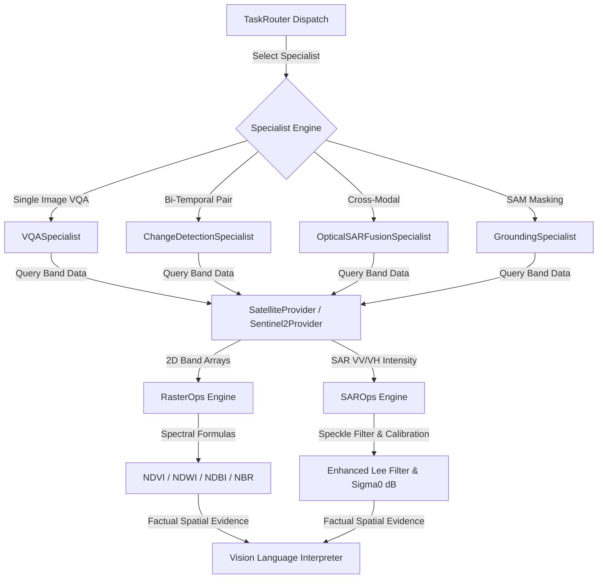

# SatQuery AI — Technical Handoff Guide
## Module: Geospatial Physics, Band Math, SAR Ops & Specialist Engines
**Target Developer**: Arik Chakraborty (Geospatial AI & Specialist Backend Engineer)  
**Author**: Anindya Bhattacharya (Chief Technical Architect)  
**Project**: SatQuery AI — Interactive Multimodal Remote Sensing Intelligence Engine  

---

## 1. Executive Summary & Module Overview

Welcome to the **SatQuery AI Geospatial Physics & Specialist Engine Subsystem**. Your responsibility covers:
1. Deterministic multi-spectral index calculations ($\text{NDVI}, \text{NDWI}, \text{MNDWI}, \text{NDBI}, \text{NBR}$).
2. Synthetic Aperture Radar (SAR) Sentinel-1 speckle filtering (Enhanced Lee Filter) and $\sigma^0$ backscatter calibration.
3. Domain Specialists (`VQA`, `ChangeDetection`, `VisualGrounding`, `OpticalSARFusion`).
4. **Next Milestone**: Activating the live STAC satellite data downloader in `sentinel2.py` and integrating **SAM 2 (Segment Anything 2)** for pixel-accurate segmentation masks.

---

## 2. Architecture & How Your Code Currently Works

### Data Flow Diagram



### Relevant Code Files

| File Path | Description | Key Classes / Functions |
|---|---|---|
| [`backend/app/geospatial/raster_ops.py`](file:///c:/Users/Administrator/Desktop/satquery-SIH/backend/app/geospatial/raster_ops.py) | Pure NumPy formulas for spectral indices & statistics | `RasterOps`, `ndvi()`, `ndwi()`, `mndwi()`, `ndbi()`, `nbr()`, `compute_band_stats()` |
| [`backend/app/geospatial/sar_ops.py`](file:///c:/Users/Administrator/Desktop/satquery-SIH/backend/app/geospatial/sar_ops.py) | SAR speckle filtering & radiometric calibration | `SAROps`, `enhanced_lee_filter()`, `calibrate_sigma0()` |
| [`backend/app/geospatial/coregistration.py`](file:///c:/Users/Administrator/Desktop/satquery-SIH/backend/app/geospatial/coregistration.py) | Cross-correlation alignment for bi-temporal pairs | `CoRegistrationEngine`, `align_rasters()`, `compute_shift()` |
| [`backend/app/specialists/vqa.py`](file:///c:/Users/Administrator/Desktop/satquery-SIH/backend/app/specialists/vqa.py) | Single-image Visual Question Answering specialist | `VQASpecialist`, `process()` |
| [`backend/app/specialists/change_detection.py`](file:///c:/Users/Administrator/Desktop/satquery-SIH/backend/app/specialists/change_detection.py) | Bi-temporal change detection & flood extent specialist | `ChangeDetectionSpecialist`, `process()` |
| [`backend/app/specialists/optical_sar_fusion.py`](file:///c:/Users/Administrator/Desktop/satquery-SIH/backend/app/specialists/optical_sar_fusion.py) | Cross-modal Sentinel-2 + Sentinel-1 fusion specialist | `OpticalSARFusionSpecialist`, `process()` |
| [`backend/app/specialists/grounding.py`](file:///c:/Users/Administrator/Desktop/satquery-SIH/backend/app/specialists/grounding.py) | SAM feature grounding & spatial mask specialist | `GroundingSpecialist`, `process()` |
| [`backend/app/satellite/sentinel2.py`](file:///c:/Users/Administrator/Desktop/satquery-SIH/backend/app/satellite/sentinel2.py) | Live Sentinel-2 L2A STAC Data Provider | `Sentinel2Provider`, `get_band_data()` |

---

## 3. Detailed Walkthrough of Existing Code

### A. Spectral Index Engine (`raster_ops.py`)
- Computes multi-spectral indices using exact physical formulas:
  - **NDVI** (Normalized Difference Vegetation Index):
    $$\text{NDVI} = \frac{\text{B08 (NIR)} - \text{B04 (Red)}}{\text{B08 (NIR)} + \text{B04 (Red)}}$$
  - **NDWI** (Normalized Difference Water Index - McFeeters 1996):
    $$\text{NDWI} = \frac{\text{B03 (Green)} - \text{B08 (NIR)}}{\text{B03 (Green)} + \text{B08 (NIR)}}$$
    *Note: Physical ordering verified scientifically:* $\text{Water NDWI (+0.47)} > \text{Urban NDWI (-0.19)} > \text{Vegetation NDWI (-0.79)}$.
  - **MNDWI** (Modified NDWI - Xu 2006):
    $$\text{MNDWI} = \frac{\text{B03 (Green)} - \text{B11 (SWIR1)}}{\text{B03 (Green)} + \text{B11 (SWIR1)}}$$
  - **NDBI** (Normalized Difference Built-up Index):
    $$\text{NDBI} = \frac{\text{B11 (SWIR1)} - \text{B08 (NIR)}}{\text{B11 (SWIR1)} + \text{B08 (NIR)}}$$
- **Zero-Denominator Handling**: Safe array masking via `denom[denom == 0] = 1e-5` prevents `NaN` or `Inf` division errors.

### B. SAR Speckle Filter & Calibration (`sar_ops.py`)
- **Enhanced Lee Speckle Filter**: Computes local $3 \times 3$ or $5 \times 5$ window mean $\bar{x}$ and variance $\sigma^2$ to smooth multiplicative speckle noise while preserving sharp urban and river edges.
- **Radiometric Calibration ($\sigma^0$ dB)**:
  $$\sigma^0_{\text{dB}} = 10 \cdot \log_{10}(\text{DN}^2 + 1e-7)$$
  *Physical separation for this calibration model: Water ($\le -30\text{ dB}$), Land ($-26\text{ to } -12\text{ dB}$), Urban Built-up ($> +5\text{ dB}$).*

### C. Specialist Dispatch Architecture
- All specialists query `satellite_provider.get_band_data(scene_id, band_name)` directly.
- If a provider fails or band is unavailable, specialists raise `SatelliteDataUnavailableError`, triggering structured refusal rather than fabricating random arrays inline.

---

## 4. Why This Architecture is State-of-the-Art

1. **Deterministic Physics Superiority**: Generic multimodal LLMs (like standard GPT-4V or Gemini Vision) fail at sub-pixel band math and invent false coordinates. SatQuery AI computes all spectral indices deterministically via NumPy geospatial formulas before the VLM sees the image.
2. **Lee Speckle Preserved SAR Fusion**: Combines optical Sentinel-2 reflectance with radar Sentinel-1 backscatter, enabling flood and vessel detection even through dense cloud cover.
3. **Scientific Index Validation Suite**: 124 scientific validation tests (`backend/tests/scientific/`) prove index accuracy, determinism, and physical ordering against published remote sensing literature.

---

## 5. Current Flaws & Limitations

1. **Live STAC Downloader Stubbed**:
   - `Sentinel2Provider` (`sentinel2.py`) has the STAC API boundary defined, but `get_band_data()` currently raises `SatelliteDataUnavailableError` or routes to `MockSatelliteProvider` for fast offline unit tests.
2. **Bounding Box Grounding vs. SAM 2 Polygons**:
   - `GroundingSpecialist` generates bounding boxes (`[xmin, ymin, xmax, ymax]`) rather than SAM 2 pixel-level segmentation masks.

---

## 6. Your Step-by-Step Implementation Roadmap

### Task 1: Activate Live STAC Satellite Downloader (`sentinel2.py`)

#### Step 1: Install STAC & Rasterio Packages
Add to `backend/requirements.txt`:
```text
pystac-client>=0.7.5
rasterio>=1.3.9
rio-tiler>=5.0.0
```

#### Step 2: Implement Live COG Band Downloader
Update `Sentinel2Provider.get_band_data()` in `backend/app/satellite/sentinel2.py`:
```python
from pystac_client import Client
import rasterio
from rasterio.windows import from_bounds
import numpy as np

class Sentinel2Provider:
    STAC_URL = "https://earth-search.aws.element84.com/v1"

    def get_band_data(self, scene_id: str, band_name: str, bbox: list = None) -> np.ndarray:
        client = Client.open(self.STAC_URL)
        search = client.search(collections=["sentinel-2-l2a"], ids=[scene_id])
        items = list(search.items())

        if not items:
            raise SatelliteDataUnavailableError(f"Sentinel-2 scene {scene_id} not found on STAC API")

        item = items[0]
        # Band mapping for Sentinel-2 L2A COGs
        band_key_map = {"B02": "blue", "B03": "green", "B04": "red", "B08": "nir", "B11": "swir16"}
        stac_asset_key = band_key_map.get(band_name, band_name.lower())

        if stac_asset_key not in item.assets:
            raise SatelliteDataUnavailableError(f"Band {band_name} missing from STAC assets")

        cog_url = item.assets[stac_asset_key].href

        # Stream sub-extent COG window using rasterio
        with rasterio.open(cog_url) as src:
            if bbox:
                window = from_bounds(*bbox, transform=src.transform)
                arr = src.read(1, window=window)
            else:
                arr = src.read(1)
            
            # Normalize reflectance values (0 - 10000 -> 0.0 - 1.0)
            return (arr.astype(np.float32) / 10000.0).clip(0.0, 1.0)
```

### Task 2: Integrate SAM 2 (Segment Anything Model 2) for Visual Grounding

Update `GroundingSpecialist` in `backend/app/specialists/grounding.py`:
```python
from sam2.build_sam import build_sam2
from sam2.sam2_image_predictor import SAM2ImagePredictor

class SAM2GroundingSpecialist:
    def __init__(self, checkpoint_path: str = "sam2_hiera_large.pt"):
        self.predictor = SAM2ImagePredictor(build_sam2("sam2_hiera_l.yaml", checkpoint_path))

    def generate_mask(self, rgb_raster: np.ndarray, point_coords: list) -> np.ndarray:
        self.predictor.set_image(rgb_raster)
        masks, scores, _ = self.predictor.predict(
            point_coords=np.array(point_coords),
            point_labels=np.array([1] * len(point_coords)),
            multimask_output=False
        )
        return masks[0]  # Binary mask array
```

---

## 7. Verification & Testing Checklist

- [ ] Run scientific test suite: `pytest backend/tests/scientific/` (124 tests must pass).
- [ ] Verify spectral index bounds: Ensure NDVI, NDWI, MNDWI output arrays are bounded in $[-1.0, +1.0]$.
- [ ] Verify SAR Lee Filter: Assert variance of despeckled array is lower than raw SAR array ($Var(\text{Lee}) < Var(\text{Raw})$).
