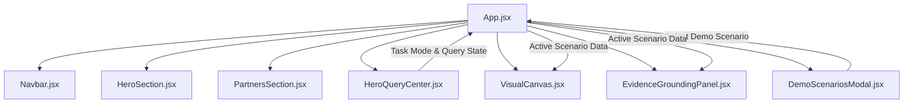

# SatQuery AI — Technical Handoff Guide
## Module: Lead Frontend Architecture, Interactive Map Canvas & UI Systems
**Target Developer**: Hussain Ansari (Lead UI/UX & Frontend Engineer)  
**Author**: Anindya Bhattacharya (Chief Technical Architect)  
**Project**: SatQuery AI — Interactive Multimodal Remote Sensing Intelligence Engine  

---

## 1. Executive Summary & Module Overview

Welcome to the **SatQuery AI Frontend Subsystem**. As Lead Frontend Engineer, your responsibility covers:
1. React 18 + Vite SPA architecture in `src/`.
2. Main platform interface (`HeroQueryCenter.jsx`, `VisualCanvas.jsx`, `Navbar.jsx`).
3. Interactive visual viewports (Bi-temporal swipe slider, Optical + SAR dual viewport, SAM overlay).
4. **Next Milestone**: Integrating **MapLibre GL / Leaflet.js** directly into `VisualCanvas.jsx` for interactive pan/zoom GIS tile mapping and opacity controls.

---

## 2. Architecture & Component Hierarchy

### Component Architecture Diagram



### Relevant Code Files

| File Path | Description | Key Components |
|---|---|---|
| [`src/App.jsx`](file:///c:/Users/Administrator/Desktop/satquery-SIH/src/App.jsx) | Main React Application state manager & layout container | `App()`, state handlers for scenario, query, and analysis status |
| [`src/components/HeroQueryCenter.jsx`](file:///c:/Users/Administrator/Desktop/satquery-SIH/src/components/HeroQueryCenter.jsx) | Task selector tabs, natural language prompt textarea, upload dropzone, run analysis button | `HeroQueryCenter()`, `TASK_MODES`, `SUGGESTED_PROMPTS` |
| [`src/components/VisualCanvas.jsx`](file:///c:/Users/Administrator/Desktop/satquery-SIH/src/components/VisualCanvas.jsx) | Interactive dual-viewport visual canvas, split slider, layer selector, SAR Lee filter toggle | `VisualCanvas()`, `sliderPos`, `activeLayer`, `sarDespeckle` |
| [`src/components/Navbar.jsx`](file:///c:/Users/Administrator/Desktop/satquery-SIH/src/components/Navbar.jsx) | Floating Glassmorphism Navigation Bar | `Navbar()`, quick navigation links & SIH demo trigger button |
| [`src/index.css`](file:///c:/Users/Administrator/Desktop/satquery-SIH/src/index.css) | Tailored Tailwind CSS design system tokens | `.glass-panel`, `.glass-nav`, `.section-tag`, `.btn-amber-glow` |

---

## 3. Detailed Walkthrough of Existing Code

### A. App State Management (`App.jsx`)
- Controls global state:
  - `activeScenario`: Current selected SIH demo scenario (defaults to Kolkata Coastal VQA).
  - `currentTask`: Active task mode (`SINGLE_IMAGE_VQA`, `VISUAL_GROUNDING`, `CHANGE_DETECTION`, `OPTICAL_SAR_FUSION`, `AGENTIC_ROUTING`).
  - `queryText`: Input text query string.
  - `isAnalyzing`: Boolean flag indicating backend execution in progress.

### B. Visual Canvas Viewport Modes (`VisualCanvas.jsx`)
- Supports **3 distinct interactive viewport modes**:
  1. **Bi-Temporal Swipe Slider Mode**: Uses a clipped `div` with absolute positioning and range input (`sliderPos` 0%–100%) to compare T1 (Before) vs T2 (After) satellite rasters.
  2. **Optical + SAR Dual Viewport Mode**: Side-by-side grid comparing optical RGB reflectance against Sentinel-1 SAR radar backscatter with real-time Lee despeckle toggle.
  3. **Single Image & SAM Grounding Mode**: Single scene display with active spectral layer filter (RGB, NDVI, NDWI, NDBI) and SAM segmentation polygon overlay.

### C. Design System & Light/Dark Palette (`index.css`)
- Light mode base palette: `#f8fafc` slate body with `#ffffff` glass panels, high-contrast slate-900 typography, and vibrant `#ea580c` orange/amber accents.

---

## 4. Why This Architecture is State-of-the-Art

1. **Multi-Viewport Vector Canvas**: Most web GIS apps only show static PNGs. SatQuery AI provides an interactive bi-temporal swipe slider and cross-modal optical+SAR dual viewport right inside the browser.
2. **Instant Scenario Pre-loading**: Allows evaluators to test 5 complex satellite scenarios without needing to upload gigabytes of GeoTIFF data.
3. **Responsive Glassmorphism UX**: Clean, modern, accessible UI built using modern Tailwind utility tokens.

---

## 5. Current Flaws & Limitations

1. **Static Raster Overlays**: Viewport currently renders static image assets rather than dynamic interactive vector map tiles (MapLibre / Leaflet).
2. **Mock Pipeline Timing**: Run analysis button uses frontend `setTimeout` triggers to demonstrate progress toast banners.

---

## 6. Your Step-by-Step Implementation Roadmap

### Task 1: Integrate MapLibre GL JS into `VisualCanvas.jsx`

#### Step 1: Install MapLibre GL
Add to `package.json`:
```bash
npm install maplibre-gl
```

#### Step 2: Create MapLibre Container Component
Create `src/components/MapLibreViewport.jsx`:
```jsx
import React, { useEffect, useRef } from 'react';
import maplibregl from 'maplibre-gl';
import 'maplibre-gl/dist/maplibre-gl.css';

export default function MapLibreViewport({ bbox, geojsonOverlay }) {
  const mapContainer = useRef(null);

  useEffect(() => {
    if (!mapContainer.current) return;

    const map = new maplibregl.Map({
      container: mapContainer.current,
      style: 'https://demotiles.maplibre.org/style.json', // Or CartoDB / Esri Satellite style
      center: [(bbox[0] + bbox[2]) / 2, (bbox[1] + bbox[3]) / 2],
      zoom: 12
    });

    map.on('load', () => {
      if (geojsonOverlay) {
        map.addSource('mask-source', {
          type: 'geojson',
          data: geojsonOverlay
        });
        map.addLayer({
          id: 'mask-layer',
          type: 'fill',
          source: 'mask-source',
          paint: {
            'fill-color': '#0088ff',
            'fill-opacity': 0.4
          }
        });
      }
    });

    return () => map.remove();
  }, [bbox, geojsonOverlay]);

  return <div ref={mapContainer} className="w-full h-full rounded-xl overflow-hidden" />;
}
```

### Task 2: Connect Live FastAPI Backend API to `App.jsx`

Update `handleRunAnalysis` in `src/App.jsx`:
```jsx
const handleRunAnalysis = async () => {
  setIsAnalyzing(true);
  try {
    const response = await fetch(`${import.meta.env.VITE_API_BASE_URL}/api/v1/analyze`, {
      method: 'POST',
      headers: { 'Content-Type': 'application/json' },
      body: JSON.stringify({
        query: queryText,
        task_mode: currentTask,
        scene_id: activeScenario.id
      })
    });
    const data = await response.json();
    console.log("Analysis Output:", data);
  } catch (err) {
    console.error("API Call Failed:", err);
  } finally {
    setIsAnalyzing(false);
  }
};
```

---

## 7. Verification & Testing Checklist

- [ ] Run `npm run build` and ensure clean Vite compilation.
- [ ] Test bi-temporal swipe slider handle drag across all screen widths.
- [ ] Verify high-contrast typography readability on light background.
