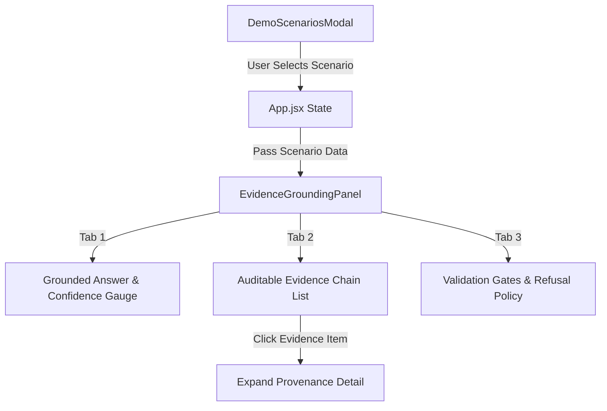

# SatQuery AI — Technical Handoff Guide
## Module: Frontend UX, Evidence Grounding Panel & SIH Demo Suite
**Target Developer**: Sargam Banerjee (Frontend & Data Visualization Engineer)  
**Author**: Anindya Bhattacharya (Chief Technical Architect)  
**Project**: SatQuery AI — Interactive Multimodal Remote Sensing Intelligence Engine  

---

## 1. Executive Summary & Module Overview

Welcome to the **SatQuery AI Evidence Grounding & UX Subsystem**. Your responsibility covers:
1. Grounded Intelligence & Evidence Chain Readout Panel (`EvidenceGroundingPanel.jsx`).
2. SIH Evaluator Demo Scenarios Modal (`DemoScenariosModal.jsx`).
3. Demo dataset contracts & pre-verified scenarios (`demoScenarios.js`).
4. System metrics, compliance checklists, and section features (`MetricsBanner.jsx`, `SIHComplianceChecklist.jsx`, `FeaturesSection.jsx`).
5. **Next Milestone**: Adding interactive spectral curve charts (Recharts / Chart.js) and real-time validation gate refusal status visualizers.

---

## 2. Architecture & How Your Code Currently Works

### Data Flow Diagram



### Relevant Code Files

| File Path | Description | Key Components |
|---|---|---|
| [`src/components/EvidenceGroundingPanel.jsx`](file:///c:/Users/Administrator/Desktop/satquery-SIH/src/components/EvidenceGroundingPanel.jsx) | Grounded response display, evidence chain logs, confidence gauge, and validation gate tabs | `EvidenceGroundingPanel()`, `activeTab`, confidence breakdown |
| [`src/components/DemoScenariosModal.jsx`](file:///c:/Users/Administrator/Desktop/satquery-SIH/src/components/DemoScenariosModal.jsx) | SIH Evaluator Demo Selection Suite modal window | `DemoScenariosModal()`, scenario list mapping |
| [`src/data/demoScenarios.js`](file:///c:/Users/Administrator/Desktop/satquery-SIH/src/data/demoScenarios.js) | Pre-verified scenario ground truth datasets | `DEMO_SCENARIOS` array |
| [`src/components/SIHComplianceChecklist.jsx`](file:///c:/Users/Administrator/Desktop/satquery-SIH/src/components/SIHComplianceChecklist.jsx) | SIH official problem statement compliance status checklist | `SIHComplianceChecklist()` |
| [`src/components/MetricsBanner.jsx`](file:///c:/Users/Administrator/Desktop/satquery-SIH/src/components/MetricsBanner.jsx) | Verification accuracy & response speed metrics banner | `MetricsBanner()` |

---

## 3. Detailed Walkthrough of Existing Code

### A. Evidence Grounding Panel (`EvidenceGroundingPanel.jsx`)
- Divided into **3 interactive tabs**:
  1. **Grounded Answer Tab**:
     - Displays factual multi-spectral answer text.
     - Confidence Badge Gauge: Displays score (e.g. `96% HIGH`) and factor breakdowns (`Cloud Cover: 0.0%`, `Co-registration Shift: 0.0px`).
     - Provenance Tag: Displays spatial CRS reference (`EPSG:32645 Verified`).
  2. **Evidence Chain Tab**:
     - Displays clickable provenance records (e.g. `[EVID-001] Sentinel-2 L2A Band B08 / B04`).
     - Clicking an item expands additional metadata details (`source`, `resolution`, `calculated_value`).
  3. **Validation Gates Tab**:
     - Lists status of refusal gates (`Cloud Cover Gate`, `Valid Pixel Ratio Gate`, `Co-Registration Alignment Gate`).
     - Displays system safeguard refusal policy card.

### B. SIH Evaluator Demo Scenarios Modal (`DemoScenariosModal.jsx`)
- Modal popup allowing evaluators to load 5 pre-configured SIH scenarios:
  - **Demo 1**: Single Image VQA & Land Cover Composition (Kolkata).
  - **Demo 2**: Visual Grounding & SAM Segmentation (Sunderbans).
  - **Demo 3**: Mandatory Bi-Temporal Change VQA (Kolkata Inundation).
  - **Demo 4**: Required Optical + SAR Multimodal Fusion (Hooghly River).
  - **Demo 5**: Agentic Task Router & Execution Sequencing.

---

## 4. Why This Architecture is State-of-the-Art

1. **Transparent Evidence Provenance**: Unlike standard AI chatbots that generate black-box answers, SatQuery AI shows the exact evidence chain `[EVID-001]` and numerical index values that prove why the answer is true.
2. **Zero Hallucination Confidence Gauge**: Displays explicit confidence breakdowns based on physical raster pixel quality.
3. **Instant Evaluator Verification**: The 5 pre-configured demo scenarios allow SIH judges to verify all capabilities instantly.

---

## 5. Current Flaws & Limitations

1. **Static Confidence Gauges**: Confidence factors are currently loaded from static JSON attributes in `demoScenarios.js`.
2. **No Interactive Charting**: Spectral indices ($\text{NDVI}$ vs $\text{NDWI}$) are displayed as text readouts rather than visual line/bar charts.

---

## 6. Your Step-by-Step Implementation Roadmap

### Task 1: Add Interactive Spectral Index Curve Charts (Recharts)

#### Step 1: Install Recharts
```bash
npm install recharts
```

#### Step 2: Create Spectral Curve Component
Create `src/components/SpectralChart.jsx`:
```jsx
import React from 'react';
import { LineChart, Line, XAxis, YAxis, Tooltip, ResponsiveContainer } from 'recharts';

const sampleData = [
  { band: 'B02 (Blue)', reflectance: 0.08 },
  { band: 'B03 (Green)', reflectance: 0.12 },
  { band: 'B04 (Red)', reflectance: 0.05 },
  { band: 'B08 (NIR)', reflectance: 0.58 },
  { band: 'B11 (SWIR1)', reflectance: 0.18 },
];

export default function SpectralChart() {
  return (
    <div className="w-full h-40 bg-slate-50 p-2 rounded-xl border border-slate-200">
      <p className="text-[11px] font-mono font-bold text-slate-700 mb-1">Spectral Reflectance Curve</p>
      <ResponsiveContainer width="100%" height="80%">
        <LineChart data={sampleData}>
          <XAxis dataKey="band" stroke="#64748b" fontSize={10} />
          <YAxis stroke="#64748b" fontSize={10} domain={[0, 1]} />
          <Tooltip />
          <Line type="monotone" dataKey="reflectance" stroke="#ea580c" strokeWidth={2} />
        </LineChart>
      </ResponsiveContainer>
    </div>
  );
}
```

#### Step 3: Embed in `EvidenceGroundingPanel.jsx`
Import `SpectralChart` inside `EvidenceGroundingPanel.jsx` under the **Grounded Answer** tab to provide visual evidence graphs!

---

## 7. Verification & Testing Checklist

- [ ] Test scenario switching in `DemoScenariosModal.jsx`: Verify query and image updates instantly.
- [ ] Test evidence chain click expansion in `EvidenceGroundingPanel.jsx`.
- [ ] Run `npm run build` and ensure clean Vite compilation.
