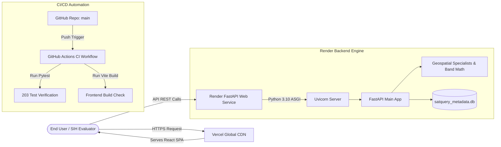

# SatQuery AI — Technical Handoff Guide
## Module: DevOps, Cloud Hosting, CI/CD & API Integration
**Target Developer**: Sujan Ramani (Team Leader & Project Operations / DevOps Lead)  
**Author**: Anindya Bhattacharya (Chief Technical Architect)  
**Project**: SatQuery AI — Interactive Multimodal Remote Sensing Intelligence Engine  

---

## 1. Executive Summary & Module Overview

Welcome to the **SatQuery AI DevOps & Integration Subsystem**. As Team Leader and DevOps Lead, your responsibility covers:
1. Cloud deployment & hosting (Frontend on Vercel, Backend on Render).
2. GitHub repository management (`Anindya-Dev/satquery-banana.git`).
3. Automated GitHub Actions CI/CD pipeline (`.github/workflows/ci.yml`).
4. Cross-Origin Resource Sharing (CORS), environment variables, and API glue.
5. **Next Milestone**: Containerizing the backend with Docker, setting up backend keep-alive pings to eliminate cold starts, and configuring strict production CORS security.

---

## 2. Architecture & Infrastructure Topology

### Deployment Architecture Diagram



### Relevant Code Files

| File Path | Description | Key Configs |
|---|---|---|
| [`.github/workflows/ci.yml`](file:///c:/Users/Administrator/Desktop/satquery-SIH/.github/workflows/ci.yml) | GitHub Actions CI workflow running backend tests & frontend build | Pytest 203 tests & Node 18 build jobs |
| [`vercel.json`](file:///c:/Users/Administrator/Desktop/satquery-SIH/vercel.json) | Vercel deployment & single-page application routing rules | `buildCommand: "npm run build"`, `outputDirectory: "dist"` |
| [`.env.example`](file:///c:/Users/Administrator/Desktop/satquery-SIH/.env.example) | Production environment variable configuration template | Server host, port, API keys, thresholds |
| [`package.json`](file:///c:/Users/Administrator/Desktop/satquery-SIH/package.json) | Node package dependencies and development scripts | `npm run build`, `npm run dev`, `test:backend` |
| [`backend/requirements.txt`](file:///c:/Users/Administrator/Desktop/satquery-SIH/backend/requirements.txt) | Python backend dependencies | `fastapi`, `uvicorn`, `litellm`, `numpy`, `pillow` |
| [`backend/app/core/config.py`](file:///c:/Users/Administrator/Desktop/satquery-SIH/backend/app/core/config.py) | Pydantic backend settings & environment variables loader | `Settings()`, `HOST`, `PORT`, `ALLOW_MOCK_FALLBACK` |

---

## 3. Detailed Walkthrough of Current Cloud Setup

### A. Frontend Vercel Deployment
- **Repo Link**: `https://github.com/Anindya-Dev/satquery-banana.git`
- **Live URL**: `https://satquery-banana.vercel.app`
- **Build Settings**:
  - Framework: `Vite`
  - Root Directory: `./`
  - Build Command: `npm run build`
  - Output Directory: `dist`
  - Environment Variable: `VITE_API_BASE_URL` = `https://satquery-backend-x0fy.onrender.com/`

### B. Backend Render Deployment
- **Live Backend URL**: `https://satquery-backend-x0fy.onrender.com`
- **Swagger Docs**: `https://satquery-backend-x0fy.onrender.com/docs`
- **Health Endpoint**: `https://satquery-backend-x0fy.onrender.com/api/v1/health`
- **Start Command**: `python -m uvicorn backend.main:app --host 0.0.0.0 --port $PORT`

### C. GitHub Actions CI Workflow (`ci.yml`)
- Triggered automatically on `push` or `pull_request` to `main`.
- **Job 1 (`backend-tests`)**: Runs Python 3.10, installs `backend/requirements.txt`, and executes `pytest` (verifying all 203 tests pass).
- **Job 2 (`frontend-build`)**: Runs Node 18, installs npm packages, and executes `npm run build`.

---

## 4. Why This Architecture is State-of-the-Art

1. **Automated Continuous Integration**: No code reaches production without passing all 203 unit, scientific, and safety tests.
2. **Serverless SPA + Scalable ASGI Engine**: Frontend is cached on Vercel's global edge CDN, while backend operates on lightweight FastAPI ASGI workers.
3. **Decoupled Environment Contracts**: Full environment template isolation between frontend (`VITE_API_BASE_URL`) and backend (`OPENAI_API_KEY`, `MAX_ALLOWED_CLOUD_PERCENT`).

---

## 5. Current Flaws & Limitations

1. **Render Free-Tier Cold Starts**: Render puts free web services to sleep after 15 minutes of inactivity (causes a ~30 second delay on first request).
2. **Wildcard CORS in Development**: CORS origins need to be locked down to the official Vercel domain for production security.

---

## 6. Your Step-by-Step Implementation Roadmap

### Task 1: Eliminate Backend Cold Starts (Keep-Alive Cron Ping)

Create a free uptime monitor on [UptimeRobot](https://uptimerobot.com) or [cron-job.org](https://cron-job.org) targeting:
`https://satquery-backend-x0fy.onrender.com/api/v1/health`
Set interval to **every 5 minutes**. This prevents Render from going to sleep during SIH evaluation!

### Task 2: Lock Down Production CORS Origins

Update `backend/main.py`:
```python
from fastapi import FastAPI
from fastapi.middleware.cors import CORSMiddleware

app = FastAPI(title="SatQuery AI Backend Engine")

origins = [
    "https://satquery-banana.vercel.app",
    "http://localhost:3000",
    "http://localhost:5173",
]

app.add_middleware(
    CORSMiddleware,
    allow_origins=origins,
    allow_credentials=True,
    allow_methods=["*"],
    allow_headers=["*"],
)
```

### Task 3: Add Docker Containerization (`Dockerfile`)

Create `Dockerfile` at repository root:
```dockerfile
# Step 1: Base Python Image
FROM python:3.10-slim

WORKDIR /app

# Step 2: Install System Dependencies
RUN apt-get update && apt-get install -y --no-install-recommends \
    build-essential \
    libgdal-dev \
    && rm -rf /var/lib/apt/lists/*

# Step 3: Install Python Packages
COPY backend/requirements.txt .
RUN pip install --no-cache-dir -r requirements.txt

# Step 4: Copy Codebase
COPY backend/ ./backend/
COPY pytest.ini .

# Step 5: Expose Port & Start Uvicorn
EXPOSE 8000
CMD ["python", "-m", "uvicorn", "backend.main:app", "--host", "0.0.0.0", "--port", "8000"]
```

---

## 7. Verification & Testing Checklist

- [ ] Run `curl https://satquery-backend-x0fy.onrender.com/api/v1/health` and verify HTTP 200 OK.
- [ ] Check GitHub Actions tab on GitHub: Verify green checkmarks for both `backend-tests` and `frontend-build`.
- [ ] Verify CORS headers allow requests from `satquery-banana.vercel.app`.
