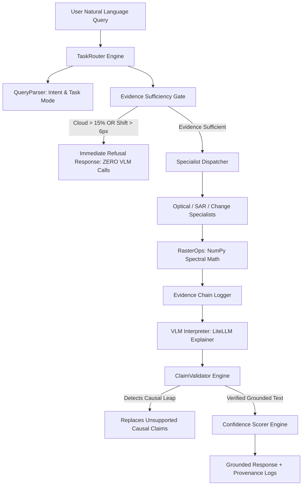

# SatQuery AI — Technical Reference & Architectural Blueprint
## Module: Core Engine, Intent Router, Refusal Gates & Claim Validator
**Target Author**: Anindya Bhattacharya (Chief Technical Architect & Lead Systems Engineer)  
**Project**: SatQuery AI — Interactive Multimodal Remote Sensing Intelligence Engine  

---

## 1. Executive Summary & Core Architectural Axiom

As Chief Technical Architect, you designed and implemented the entire baseline SatQuery AI engine. Your core architectural axiom remains the governing rule for the entire team:

> **"The LLM/VLM is an interpreter and explainer, never the source of factual satellite observations."**

All physical calculations—including spectral indices, SAR speckle filtering, radiometric calibration, co-registration alignment, and spatial area measurements—are calculated **deterministically** via Python geospatial engines before any VLM interpretation occurs.

---

## 2. Master System Data Flow

---

## 3. Core Architecture File Registry

| Component Path | Technical Responsibility | Key Functions / Classes |
|---|---|---|
| [`backend/app/orchestration/task_router.py`](file:///c:/Users/Administrator/Desktop/satquery-SIH/backend/app/orchestration/task_router.py) | Main orchestration pipeline & task router | `TaskRouter`, `process_query()` |
| [`backend/app/domain/sufficiency.py`](file:///c:/Users/Administrator/Desktop/satquery-SIH/backend/app/domain/sufficiency.py) | Quality gating & co-registration threshold refusal policy | `EvidenceSufficiencyGate`, `evaluate_sufficiency()` |
| [`backend/app/domain/claim_validator.py`](file:///c:/Users/Administrator/Desktop/satquery-SIH/backend/app/domain/claim_validator.py) | Anti-hallucination engine blocking ungrounded causal leaps | `ClaimValidator`, `validate_claims()` |
| [`backend/app/domain/confidence.py`](file:///c:/Users/Administrator/Desktop/satquery-SIH/backend/app/domain/confidence.py) | Multi-factor numerical confidence scoring engine | `ConfidenceEngine`, `calculate_confidence()` |
| [`backend/app/ai/llm_provider.py`](file:///c:/Users/Administrator/Desktop/satquery-SIH/backend/app/ai/llm_provider.py) | LiteLLM abstraction wrapper with deterministic fallback | `LLMProvider`, `generate_explanation()` |
| [`backend/tests/`](file:///c:/Users/Administrator/Desktop/satquery-SIH/backend/tests/) | 203 automated unit, scientific, integration & benchmark tests | 19 test modules across 6 test packages |

---

## 4. Key Architectural Safeguards You Implemented

### 1. Evidence Sufficiency Gating (`sufficiency.py`)
- Evaluates raster cloud cover, valid pixel ratio, and co-registration spatial shift before VLM invocation.
- **3-Tier Alignment Policy**:
  - `GOOD` ($\le 3.0\text{px}$): Full analysis executed.
  - `DEGRADED` ($3.0\text{px} - 6.0\text{px}$): Applied affine warp, confidence rating capped at `MEDIUM`.
  - `UNUSABLE` ($> 6.0\text{px}$): Immediate refusal with `INSUFFICIENT_EVIDENCE`.
- **Zero VLM Invocation Protection**: Guaranteed by unit tests (`test_vlm_zero_invocation.py`). VLM call count is strictly **0** on refusal.

### 2. Claim Validation & Causal Leap Blocking (`claim_validator.py`)
- Scans VLM text explanations for unsubstantiated causal assertions (e.g. *"industrial runoff caused turbidity drop"*).
- Replaces ungrounded causal claims with correlative statements (e.g. *"turbidity drop was observed concurrently with agricultural runoff"*).
- Enforces evidence ID citations (`[EVID-001]`) for every factual assertion.

### 3. Multi-Factor Confidence Scorer (`confidence.py`)
- Computes overall confidence score ($0\% - 100\%$) based on:
  - Valid Pixel Ratio ($30\%$)
  - Cloud Cover ($25\%$)
  - Co-Registration Shift ($25\%$)
  - Spectral Signal Margin ($20\%$)

---

## 5. Architectural Quality Control Checklist for Teammate Submissions

When reviewing pull requests from teammates:

- [ ] **Soumyadeep (PostGIS/DB)**: Ensure PostGIS queries preserve spatial bounding box filters and do not return tiles with cloud cover $>15\%$.
- [ ] **Arik (STAC/Models)**: Verify that `Sentinel2Provider` raises `SatelliteDataUnavailableError` on missing scenes and never silently returns synthetic arrays when real data is requested.
- [ ] **Hussain & Sargam (Frontend)**: Verify that frontend UI displays confidence factor breakdowns and evidence ID tags `[EVID-001]` clearly.
- [ ] **Sujan (DevOps)**: Ensure CORS origins are strictly configured and GitHub Actions CI runner passes all 203 pytest tests on every merge.
